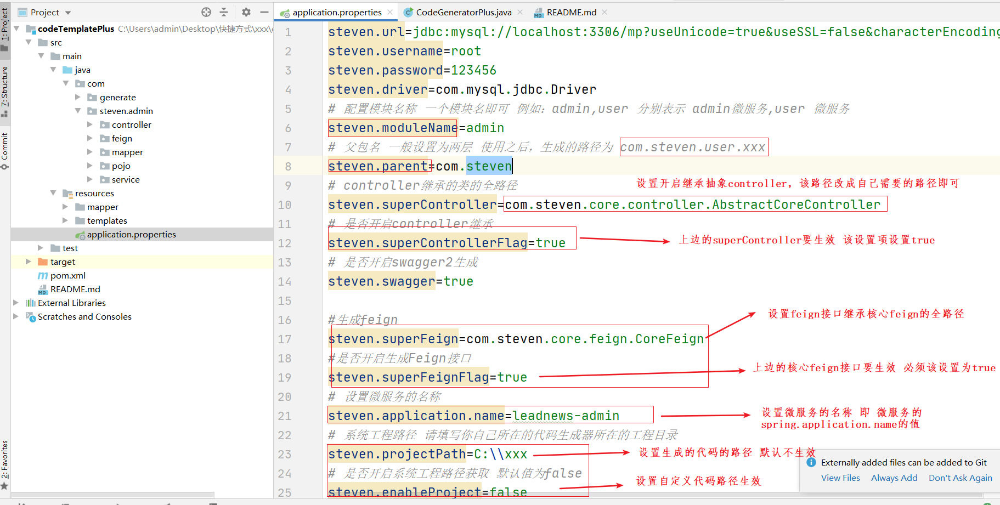
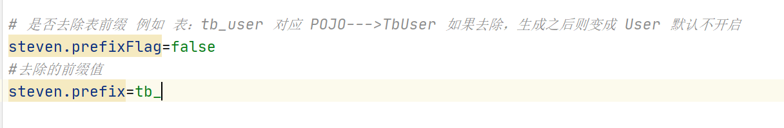

# 代码生成器


## 1 使用说明

在resource目录下设置application.properties如下：可根据自己的需求进行设置

```properties
steven.url=jdbc:mysql://localhost:3306/mp?useUnicode=true&useSSL=false&characterEncoding=utf8
steven.username=root
steven.password=123456
steven.driver=com.mysql.jdbc.Driver
# 配置模块名称 一个模块名即可 例如：admin,user 分别表示 admin微服务,user 微服务
steven.moduleName=admin
# 父包名 一般设置为两层 使用之后，生成的路径为 com.steven.user.xxx
steven.parent=com.steven
# controller继承的类的全路径
steven.superController=com.steven.core.controller.AbstractCoreController
# 是否开启controller继承
steven.superControllerFlag=true
# 是否开启swagger2生成
steven.swagger=true

#生成feign
steven.superFeign=com.steven.core.feign.CoreFeign
#是否开启生成Feign接口
steven.superFeignFlag=true
# 设置微服务的名称
steven.application.name=leadnews-admin
# 系统工程路径 请填写你自己所在的代码生成器所在的工程目录
steven.projectPath=C:\\xxx
# 是否开启系统工程路径获取 默认值为false
steven.enableProject=false

# 是否去除表前缀 例如 表：tb_user 对应 POJO--->TbUser 如果去除，生成之后则变成 User 默认不开启
steven.prefixFlag=false
#去除的前缀值
steven.prefix=tb_
```


各配置意义如下图所示：




## 2 bug修复记录


1 添加swagger在controller


2 添加可以设置去除前缀




